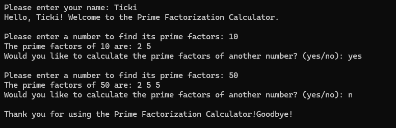

# Prime Factorization Calculator

## Description

This is a simple **Prime Factorization Calculator** implemented in C++. The program calculates and displays the prime factors of a given number. It repeatedly divides the number by prime factors, starting from 2, until the number is fully factorized.

### Screenshot

Below is a screenshot of the program in action:

### How to Use

1. The program will ask you to enter your name.
2. Then, you will be prompted to input a number to find its prime factors.
3. The program will calculate and display the prime factors of the entered number.
4. If you'd like to calculate the prime factors for another number, you can choose to continue.
5. The game continues until you decide to exit.

## How to Run

1. Clone the repository.
2. Open the project in your favorite C++ IDE or compiler.
3. Compile and run the program.
